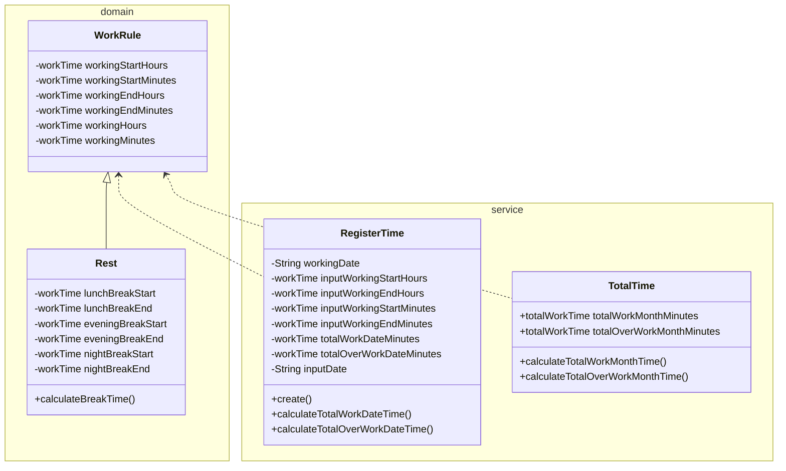

```mermaid
classDiagram
    namespace domain {
        class WorkRule{
            -workTime workingStartHours
            -workTime workingStartMinutes
            -workTime workingEndHours
            -workTime workingEndMinutes
            -workTime workingHours
            -workTime workingMinutes
        }
    
        class Rest{
            -workTime lunchBreakStart
            -workTime lunchBreakEnd
            -workTime eveningBreakStart
            -workTime eveningBreakEnd
            -workTime nightBreakStart
            -workTime nightBreakEnd
            +calculateBreakTime()
        } 
        }
        namespace service {
            class RegisterTime{
                -String workingDate
                -workTime inputWorkingStartHours
                -workTime inputWorkingEndHours
                -workTime inputWorkingStartMinutes
                -workTime inputWorkingEndMinutes
                -workTime totalWorkDateMinutes
                -workTime totalOverWorkDateMinutes
                -String inputDate
                +create()
                +calculateTotalWorkDateTime()
                +calculateTotalOverWorkDateTime()
            }
            class TotalTime{
                +totalWorkTime totalWorkMonthMinutes
                +totalWorkTime totalOverWorkMonthMinutes
                +calculateTotalWorkMonthTime()
                +calculateTotalOverWorkMonthTime()
            }
            }
        WorkRule <|-- Rest
        WorkRule <.. RegisterTime
        WorkRule <.. TotalTime


```
