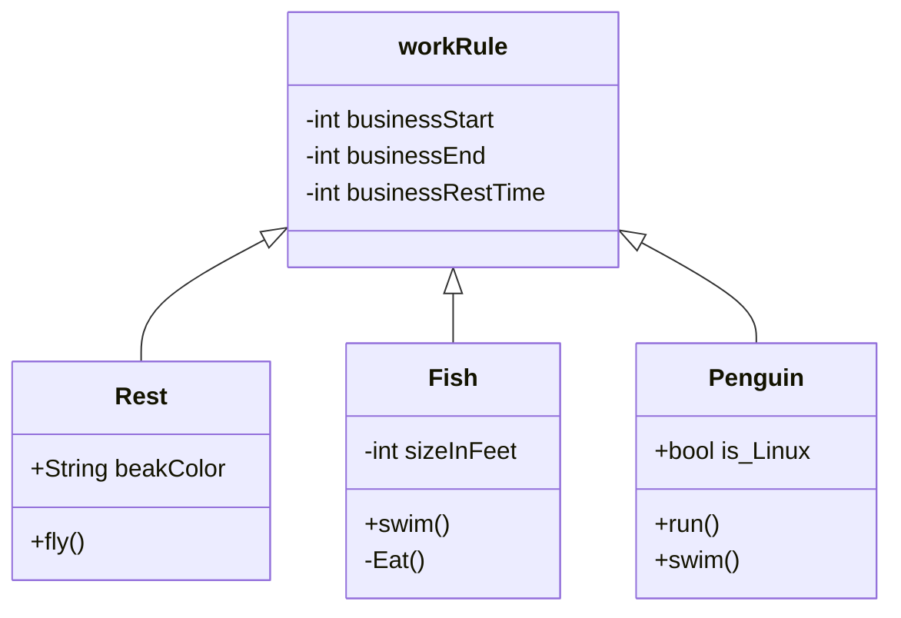

```mermaid
classDiagram
    workRule <|-- Rest
    workRule <|-- Fish
    workRule <|-- Penguin
    workRule : -int businessStart
    workRule : -int businessEnd
    workRule : -int businessRestTime

    class Rest{
        +String beakColor
        +fly()
    }
    class Fish{
        -int sizeInFeet
        +swim()
        -Eat()
    }
    class Penguin{
        +bool is_Linux
        +run()
        +swim()
    }


```
