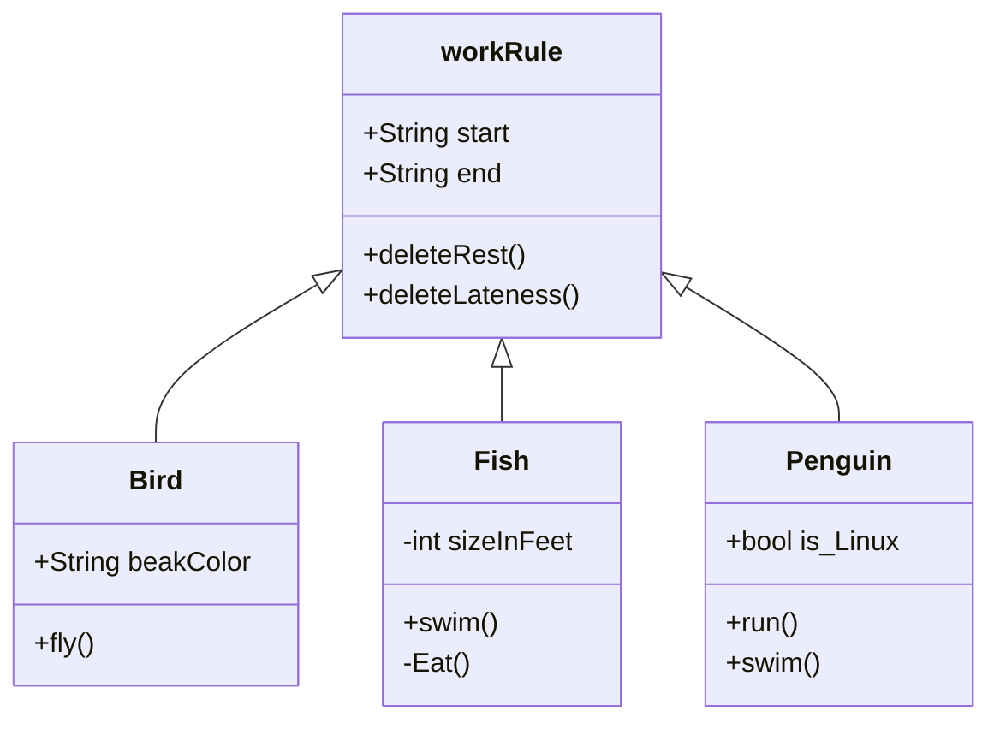

```mermaid
classDiagram
    workRule <|-- Bird
    workRule <|-- Fish
    workRule <|-- Penguin
    workRule : +String start
    workRule : +String end
    workRule:  +deleteRest()
    workRule:  +deleteLateness()
    class Bird{
        +String beakColor
        +fly()
    }
    class Fish{
        -int sizeInFeet
        +swim()
        -Eat()
    }
    class Penguin{
        +bool is_Linux
        +run()
        +swim()
    }


```
