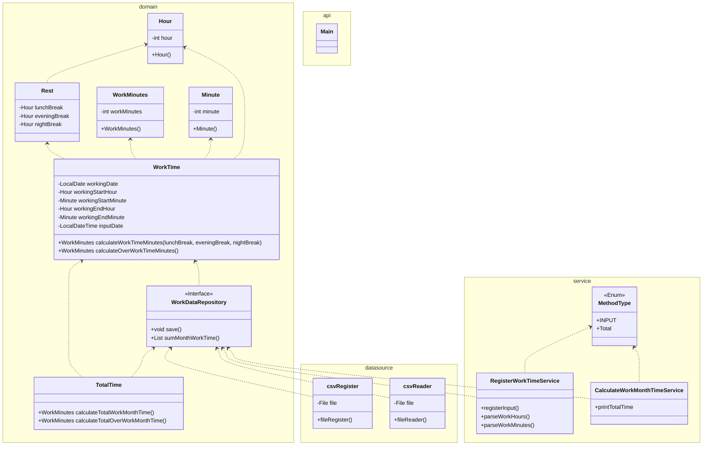

```mermaid
classDiagram
    namespace domain {
    
    　　class Hour{
            -int hour
            +Hour()
        }
        class Minute{
            -int minute
            +Minute()
        }
        class WorkMinutes{
            -int workMinutes
            +WorkMinutes()
        }
        class Rest{
            -Hour lunchBreak
            -Hour eveningBreak
            -Hour nightBreak
        } 
        class WorkTime{
            -LocalDate workingDate
            -Hour workingStartHour
            -Minute workingStartMinute
            -Hour workingEndHour
            -Minute workingEndMinute
            -LocalDateTime inputDate
            +WorkMinutes calculateWorkTimeMinutes(lunchBreak, eveningBreak, nightBreak)
            +WorkMinutes calculateOverWorkTimeMinutes()
        }
        class TotalTime{
            +WorkMinutes calculateTotalWorkMonthTime()
            +WorkMinutes calculateTotalOverWorkMonthTime()
        }
        class WorkDataRepository{
            <<Interface>>
            +void save()
            +List<WorkTime> sumMonthWorkTime()
        }
        }
    namespace service {
        class RegisterWorkTimeService{
            +registerInput()
            +parseWorkHours()
            +parseWorkMinutes()
        }
        class MethodType{
            <<Enum>>
            +INPUT
            +Total
        }
        class CalculateWorkMonthTimeService{
            +printTotalTime
        }
    }
    namespace datasource {
        class csvRegister{
            -File file
            +fileRegister()
        } 
        class csvReader{
            -File file
            +fileReader()
        } 
        }
    namespace api {
        class Main{
            
        }
        }
        
        Hour <.. WorkTime
        Hour <.. Rest
        Minute <.. WorkTime
        WorkMinutes <.. WorkTime
        WorkTime <.. WorkDataRepository
        WorkDataRepository <.. TotalTime
        WorkTime <.. TotalTime
        Rest <.. WorkTime
        WorkDataRepository <.. CalculateWorkMonthTimeService
        WorkDataRepository <.. RegisterWorkTimeService
        WorkDataRepository <.. csvRegister
        WorkDataRepository <.. csvReader
        MethodType <.. RegisterWorkTimeService
        MethodType <.. CalculateWorkMonthTimeService
%%ロジックはドメイン層　手段とロジックは分ける
%%ヒト：従業員
%%モノ：就業規則、開始時間、終業時間、就業時間、休憩時間、休憩開始時刻、休憩終了時刻、CSV
%%コト：登録する、計算する、入力する
%%変数の型で依存しているかを判断する
%%インターフェース
%%サービス層はシナリオ
%%もしデータベースの実装を変更したい場合、
%%サービスがデータソースに依存してしまう。
%%ー＞インターフェースを経由
%%重複している部分は何？
%%それぞれが何をどう呼び出している？
%%オブジェクト指向じゃない？
%%変数だけのクラスは変では無い　責務が果たされているかどうか
%%楽して良いものを作る
%%メソッド経由でprivate修飾子にアクセス可能　なぜメソッド経由？
%%インスタンスメソッド：複数それぞれのインスタンスが使えるようなメソッド
%%スタティックメソッド：それ以外
%%DynamoDB：NTTAPIの保存

%%再起：遅い、for文での状態書き換えというデメリットを解決？
%%ドメインには責務、サービス層には流れ（入館証の例（社員クラスに入館証クラスを紐付け））

%%親クラスに不確定要素を書けない　攻撃力みたいな)
%%-> 子クラスに定義し忘れたらどうする？
%%-> 抽象メソッド（不確定メソッド）で解決　オーバーライドも強制
%%例) キャラクラス（親）には必ず攻撃メソッドを持つべきだ
%% newでインスタンス化しちゃいけないクラス　ー＞　抽象クラスで解決
%% インターフェース：抽象の抽象　フィールドを持たない
%% ポリモーフィズム：ザックリとらえる 同じとして捉えて良いか
%% どのような思いで作成したか、工夫した点など　今後は？
%% どこかに入力情報を保持するためのクラスがいるかも
%% インターフェースからCSVデータを読み取る
```
