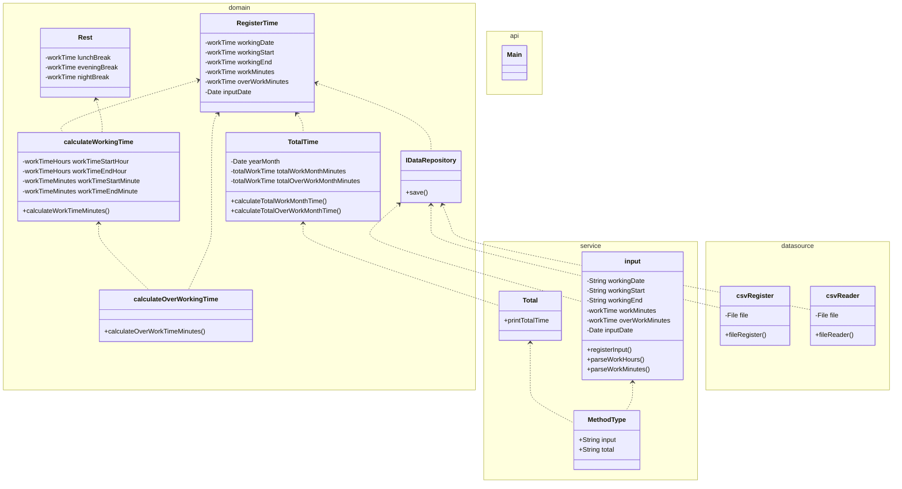

```mermaid
classDiagram
    namespace domain {
    
        class Rest{
            -workTime lunchBreak
            -workTime eveningBreak
            -workTime nightBreak
        } 
        class RegisterTime{
            -workTime workingDate
            -workTime workingStart
            -workTime workingEnd
            -workTime workMinutes
            -workTime overWorkMinutes
            -Date inputDate
        }
        class TotalTime{
            -Date yearMonth
            -totalWorkTime totalWorkMonthMinutes
            -totalWorkTime totalOverWorkMonthMinutes
            +calculateTotalWorkMonthTime()
            +calculateTotalOverWorkMonthTime()
        }
        class calculateWorkingTime{
            -workTimeHours workTimeStartHour
            -workTimeHours workTimeEndHour
            -workTimeMinutes workTimeStartMinute
            -workTimeMinutes workTimeEndMinute
            +calculateWorkTimeMinutes()
        }
        class calculateOverWorkingTime{
            +calculateOverWorkTimeMinutes()
        }
        class IDataRepository{
            +save()
        }
        }
    namespace service {
        class input{
            -String workingDate
            -String workingStart
            -String workingEnd
            -workTime workMinutes
            -workTime overWorkMinutes
            -Date inputDate
            +registerInput()
            +parseWorkHours()
            +parseWorkMinutes()
        }
        class MethodType{
            +String input
            +String total
        }
        class Total{
            +printTotalTime
        }
    }
    namespace datasource {
        class csvRegister{
            -File file
            +fileRegister()
        } 
        class csvReader{
            -File file
            +fileReader()
        } 
        }
    namespace api {
        class Main{
            
        }
        }
        
        Rest <.. calculateWorkingTime
        RegisterTime <.. calculateWorkingTime
        RegisterTime <.. calculateOverWorkingTime
        RegisterTime <.. IDataRepository
        RegisterTime <.. TotalTime
        TotalTime <.. Total
        IDataRepository <.. input
        IDataRepository <.. csvRegister
        IDataRepository <.. csvReader
        input <.. MethodType
        Total <.. MethodType
        calculateWorkingTime <.. calculateOverWorkingTime
%%ロジックはドメイン層　手段とロジックは分ける
%%ヒト：従業員
%%モノ：就業規則、開始時間、終業時間、就業時間、休憩時間、休憩開始時刻、休憩終了時刻、CSV
%%コト：登録する、計算する、入力する
%%変数の型で依存しているかを判断する
%%インターフェース
%%サービス層はシナリオ
%%もしデータベースの実装を変更したい場合、
%%サービスがデータソースに依存してしまう。
%%ー＞インターフェースを経由
%%重複している部分は何？
%%それぞれが何をどう呼び出している？
%%オブジェクト指向じゃない？
%%変数だけのクラスは変では無い　責務が果たされているかどうか
```
