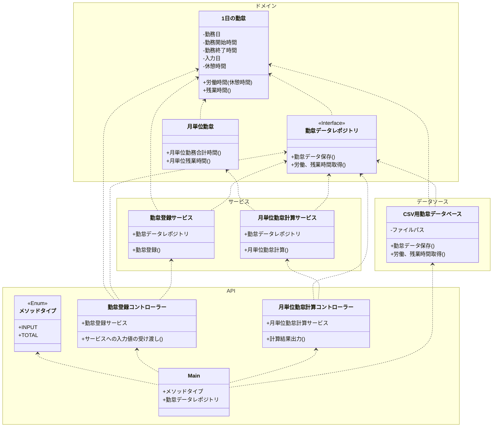

```mermaid
classDiagram 　
    namespace ドメイン {
    　　class 1日の勤怠{
          -勤務日
          -勤務開始時間
          -勤務終了時間
          -入力日
          -休憩時間
          +労働時間(休憩時間)
          +残業時間()
      }
       class 月単位勤怠{
           +月単位勤務合計時間()
           +月単位残業時間()
       }
       class 勤怠データレポジトリ{
           <<Interface>>
           +勤怠データ保存()
           +労働、残業時間取得()
       }
    }
    namespace サービス {
        class 勤怠登録サービス{
            +勤怠データレポジトリ
            +勤怠登録()
        }
        class 月単位勤怠計算サービス{
            +勤怠データレポジトリ
            +月単位勤怠計算()
        }
    }
    namespace データソース{ 
        class CSV用勤怠データベース{
            -ファイルパス
            +勤怠データ保存()
            +労働、残業時間取得()
        }
    }
    namespace API{
        class 勤怠登録コントローラー{
            +勤怠登録サービス
            +サービスへの入力値の受け渡し()
        }
        class 月単位勤怠計算コントローラー{
            +月単位勤怠計算サービス
            +計算結果出力()
        }
        class メソッドタイプ{
            <<Enum>>
            +INPUT
            +TOTAL
        }
        class Main{
            +メソッドタイプ
            +勤怠データレポジトリ
        }
    }
    
    1日の勤怠 <.. 月単位勤怠
    1日の勤怠 <.. 勤怠データレポジトリ
    1日の勤怠 <.. 勤怠登録サービス
    勤怠データレポジトリ <.. 勤怠登録サービス
    月単位勤怠 <.. 月単位勤怠計算サービス
    勤怠データレポジトリ <.. 月単位勤怠計算サービス
    1日の勤怠 <.. CSV用勤怠データベース
    勤怠データレポジトリ <.. CSV用勤怠データベース
    1日の勤怠 <.. 勤怠登録コントローラー
    勤怠データレポジトリ <.. 勤怠登録コントローラー
    勤怠登録サービス <.. 勤怠登録コントローラー
    勤怠データレポジトリ <.. 月単位勤怠計算コントローラー
    月単位勤怠計算サービス <.. 月単位勤怠計算コントローラー
    メソッドタイプ <.. Main
    勤怠登録コントローラー <.. Main
    月単位勤怠計算コントローラー <.. Main
    CSV用勤怠データベース <.. Main
    
```
