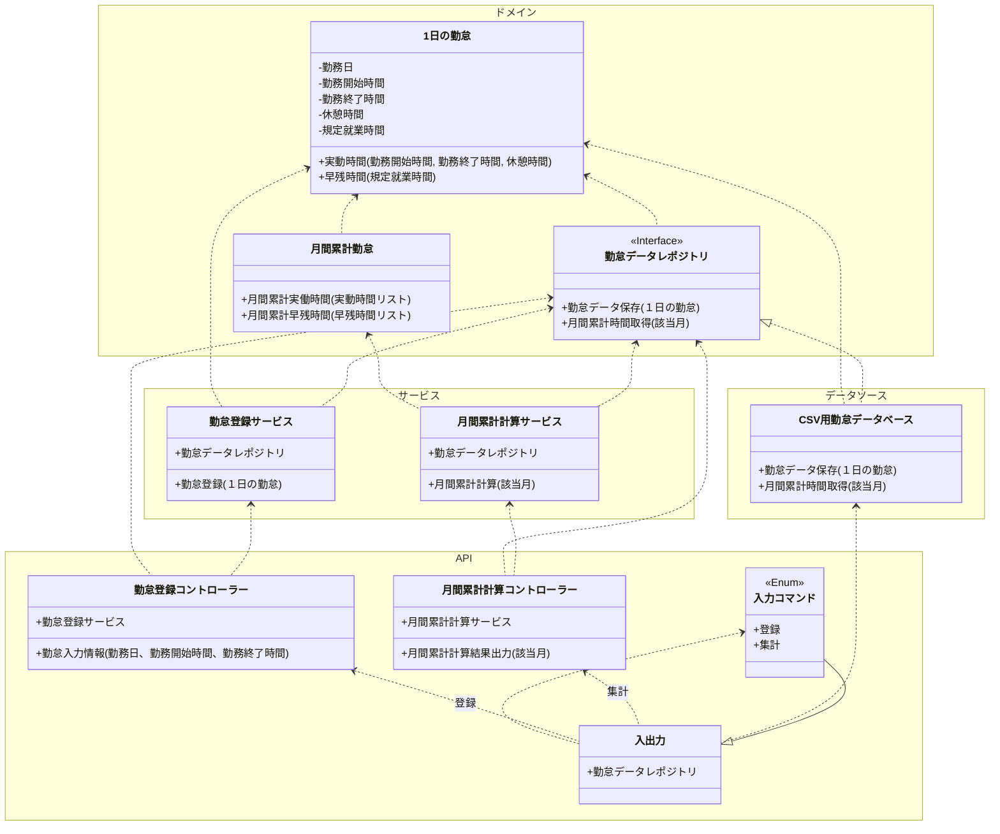

```mermaid
classDiagram 　
    namespace ドメイン {
    　　class 1日の勤怠{
          -勤務日
          -勤務開始時間
          -勤務終了時間
          -休憩時間
          -規定就業時間
          +実動時間(勤務開始時間, 勤務終了時間, 休憩時間)
          +早残時間(規定就業時間)
      }
       class 月間累計勤怠{
           +月間累計実働時間(実動時間リスト)
           +月間累計早残時間(早残時間リスト)
       }
       class 勤怠データレポジトリ{
           <<Interface>>
           +勤怠データ保存(１日の勤怠)
           +月間累計時間取得(該当月)
       }
    }
    namespace サービス {
        class 勤怠登録サービス{
            +勤怠データレポジトリ
            +勤怠登録(１日の勤怠)
        }
        class 月間累計計算サービス{
            +勤怠データレポジトリ
            +月間累計計算(該当月)
        }
    }
    namespace データソース{ 
        class CSV用勤怠データベース{
            +勤怠データ保存(１日の勤怠)
            +月間累計時間取得(該当月)
        }
    }
    namespace API{
        class 勤怠登録コントローラー{
            +勤怠登録サービス
            +勤怠入力情報(勤務日、勤務開始時間、勤務終了時間)
        }
        class 月間累計計算コントローラー{
            +月間累計計算サービス
            +月間累計計算結果出力(該当月)
        }
        class 入力コマンド{
            <<Enum>>
            +登録
            +集計
        }
        class 入出力{
            +勤怠データレポジトリ
        }
    }
    
    1日の勤怠 <.. 月間累計勤怠
    1日の勤怠 <.. 勤怠データレポジトリ
    1日の勤怠 <.. 勤怠登録サービス
    勤怠データレポジトリ <.. 勤怠登録サービス
    月間累計勤怠 <.. 月間累計計算サービス
    勤怠データレポジトリ <.. 月間累計計算サービス
    1日の勤怠 <.. CSV用勤怠データベース
    勤怠データレポジトリ <|.. CSV用勤怠データベース
    勤怠データレポジトリ <.. 勤怠登録コントローラー
    勤怠登録サービス <.. 勤怠登録コントローラー
    勤怠データレポジトリ <.. 月間累計計算コントローラー
    月間累計計算サービス <.. 月間累計計算コントローラー
    入力コマンド <.. 入出力
    勤怠登録コントローラー <.. 入出力: 登録
    月間累計計算コントローラー <.. 入出力: 集計
    CSV用勤怠データベース <.. 入出力
    入力コマンド --|> 入出力
    
```
